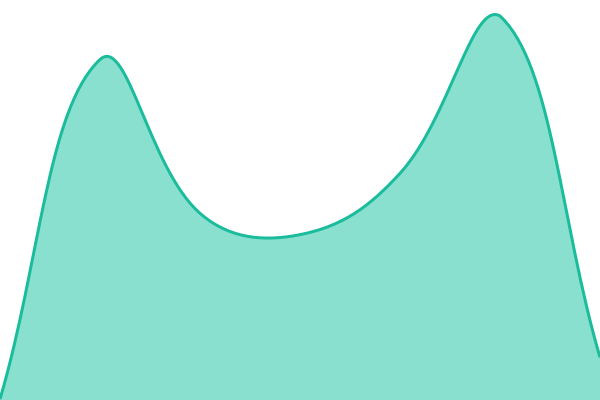
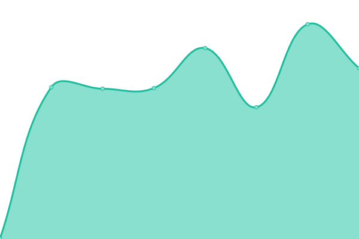
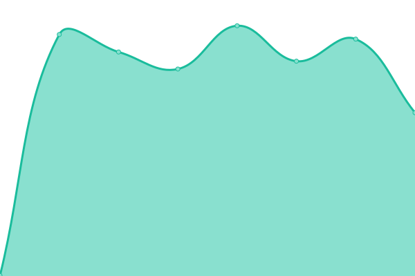
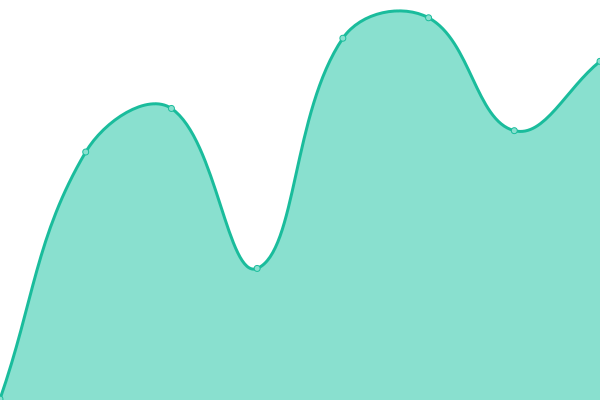
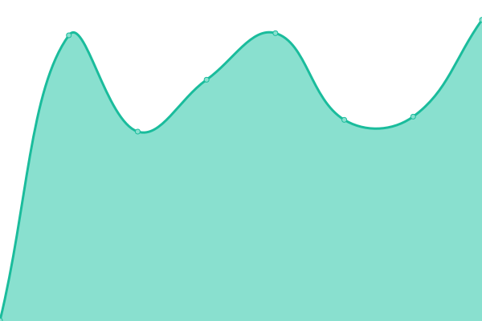
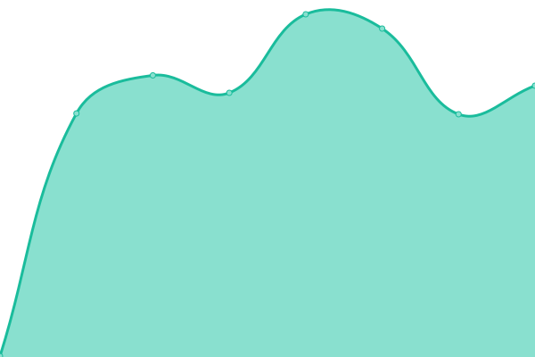
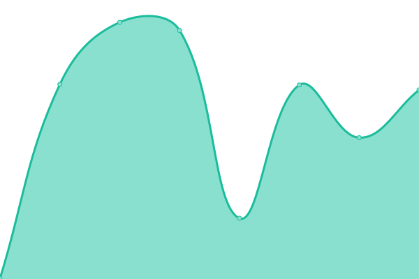
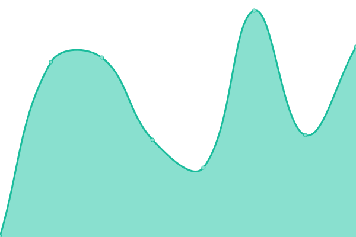
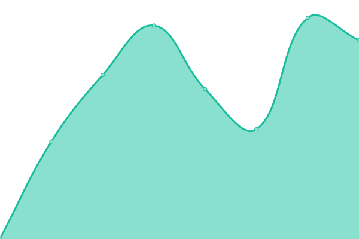

This repository contains the open-source uptime monitor and status page for [Cardano Foundation](https://cardanofoundation.org), powered by [Upptime](https://github.com/upptime/upptime).

With [Upptime](https://upptime.js.org), you can get your own unlimited and free uptime monitor and status page, powered entirely by a GitHub repository. We use [Issues](https://github.com/cardano-foundation/cf-summit-evoting-status/issues) as incident reports, [Actions](https://github.com/cardano-foundation/cf-summit-evoting-status/actions) as uptime monitors, and [Pages](https://status2025.backend.voting.summit.cardano.org) for the status page.

# [📈 Live Status](https://status2025.backend.voting.summit.cardano.org): <!--live status--> **🟨 Degraded performance**

<!--start: status pages-->
<!-- This summary is generated by Upptime (https://github.com/upptime/upptime) -->
<!-- Do not edit this manually, your changes will be overwritten -->
<!-- prettier-ignore -->
| URL | Status | History | Response Time | Uptime |
| --- | ------ | ------- | ------------- | ------ |
|  [voting.summit.cardano.org](https://voting.summit.cardano.org/) | 🟩 Up | [voting-summit-cardano-org.yml](https://github.com/cardano-foundation/cf-summit-evoting-status/commits/HEAD/history/voting-summit-cardano-org.yml) | 

 220ms
     
 | 

<a href="https://status2025.backend.voting.summit.cardano.org/history/voting-summit-cardano-org">100.00%</a>
    

|  [event-api](https://follower-api.backend.voting.summit.cardano.org/api/reference/event/CARDANO_SUMMIT_AWARDS_2025) | 🟩 Up | [event-api.yml](https://github.com/cardano-foundation/cf-summit-evoting-status/commits/HEAD/history/event-api.yml) | 

 496ms
     
 | 

<a href="https://status2025.backend.voting.summit.cardano.org/history/event-api">100.00%</a>
    

|  [user-verification-api](https://user-verification.backend.voting.summit.cardano.org/api/sms/user-verification/start-verification) | 🟩 Up | [user-verification-api.yml](https://github.com/cardano-foundation/cf-summit-evoting-status/commits/HEAD/history/user-verification-api.yml) | 

 549ms
     
 | 

<a href="https://status2025.backend.voting.summit.cardano.org/history/user-verification-api">100.00%</a>
    

|  [blockchain-follower-api](https://follower-api.backend.voting.summit.cardano.org/api/blockchain/tip) | 🟩 Up | [blockchain-follower-api.yml](https://github.com/cardano-foundation/cf-summit-evoting-status/commits/HEAD/history/blockchain-follower-api.yml) | 

 357ms
     
 | 

<a href="https://status2025.backend.voting.summit.cardano.org/history/blockchain-follower-api">100.00%</a>
    

|  [login-api](http://api.backend.voting.summit.cardano.org/api/auth/login) | 🟨 Degraded | [login-api.yml](https://github.com/cardano-foundation/cf-summit-evoting-status/commits/HEAD/history/login-api.yml) | 

 1158ms
     
 | 

<a href="https://status2025.backend.voting.summit.cardano.org/history/login-api">99.99%</a>
    

|  [cast-vote-api](http://api.backend.voting.summit.cardano.org/api/vote/cast) | 🟨 Degraded | [cast-vote-api.yml](https://github.com/cardano-foundation/cf-summit-evoting-status/commits/HEAD/history/cast-vote-api.yml) | 

 731ms
     
 | 

<a href="https://status2025.backend.voting.summit.cardano.org/history/cast-vote-api">99.99%</a>
    

|  [get-votes-api](http://api.backend.voting.summit.cardano.org/api/vote/votes/CARDANO_SUMMIT_AWARDS_2025) | 🟨 Degraded | [get-votes-api.yml](https://github.com/cardano-foundation/cf-summit-evoting-status/commits/HEAD/history/get-votes-api.yml) | 

 762ms
     
 | 

<a href="https://status2025.backend.voting.summit.cardano.org/history/get-votes-api">99.99%</a>
    

|  [get-vote-receipt-api](http://api.backend.voting.summit.cardano.org/api/vote/receipt/CARDANO_SUMMIT_AWARDS_2025/AMBASSADOR) | 🟨 Degraded | [get-vote-receipt-api.yml](https://github.com/cardano-foundation/cf-summit-evoting-status/commits/HEAD/history/get-vote-receipt-api.yml) | 

 677ms
     
 | 

<a href="https://status2025.backend.voting.summit.cardano.org/history/get-vote-receipt-api">100.00%</a>
    

|  [keria](http://keria.backend.voting.summit.cardano.org) | 🟩 Up | [keria.yml](https://github.com/cardano-foundation/cf-summit-evoting-status/commits/HEAD/history/keria.yml) | 

 512ms
     
 | 

<a href="https://status2025.backend.voting.summit.cardano.org/history/keria">100.00%</a>
    

<!--end: status pages-->

[**Visit our status website →**](https://status2025.backend.voting.summit.cardano.org)

## 📄 License

- Powered by: [Upptime](https://github.com/upptime/upptime)
- Code: [MIT](./LICENSE) © [Cardano Foundation](https://cardanofoundation.org)
- Data in the `./history` directory: [Open Database License](https://opendatacommons.org/licenses/odbl/1-0/)
