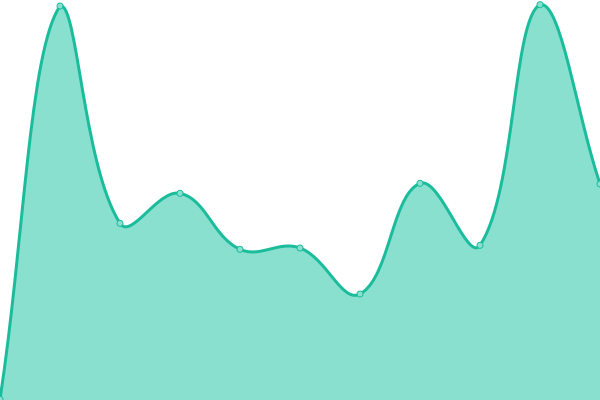

# [📈 Live Status](https://rcmorano.github.io/upptime-poc): <!--live status--> **🟩 All systems operational**

This repository contains the open-source uptime monitor and status page for the [Cardano Ballot app for Cardano Summit 2022](https://voting.summit.cardano.org/), powered by [Upptime](https://github.com/upptime/upptime).

With [Upptime](https://upptime.js.org), you can get your own unlimited and free uptime monitor and status page, powered entirely by a GitHub repository. We use [Issues](https://github.com/rcmorano/upptime-poc/issues) as incident reports, [Actions](https://github.com/rcmorano/upptime-poc/actions) as uptime monitors, and [Pages](https://rcmorano.github.io/upptime-poc) for the status page.

<!--start: status pages-->
<!-- This summary is generated by Upptime (https://github.com/upptime/upptime) -->
<!-- Do not edit this manually, your changes will be overwritten -->
<!-- prettier-ignore -->
| URL | Status | History | Response Time | Uptime |
| --- | ------ | ------- | ------------- | ------ |
|  [voting.summit.cardano.org](https://voting.summit.cardano.org/) | 🟩 Up | [voting-summit-cardano-org.yml](https://github.com/cardano-foundation/cf-summit-evoting-status/commits/HEAD/history/voting-summit-cardano-org.yml) | 

 450ms
     
 | 

<a href="https://status.voting.summit.cardano.org/history/voting-summit-cardano-org">99.80%</a>
    

|  [voter-service-AWARD-categories](https://voting.summit.cardano.org/api/reference/categories/M4ep/AWARD) | 🟩 Up | [voter-service-award-categories.yml](https://github.com/cardano-foundation/cf-summit-evoting-status/commits/HEAD/history/voter-service-award-categories.yml) | 

 514ms
     
 | 

<a href="https://status.voting.summit.cardano.org/history/voter-service-award-categories">99.80%</a>
    

|  [voter-service-SPEAKERS-categories](https://voting.summit.cardano.org/api/reference/categories/M4ep/SPEAKER) | 🟩 Up | [voter-service-speakers-categories.yml](https://github.com/cardano-foundation/cf-summit-evoting-status/commits/HEAD/history/voter-service-speakers-categories.yml) | 

 581ms
     
 | 

<a href="https://status.voting.summit.cardano.org/history/voter-service-speakers-categories">99.80%</a>
    

|  [voter-service-cast-vote](https://voting.summit.cardano.org/api/voting/cast-vote) | 🟩 Up | [voter-service-cast-vote.yml](https://github.com/cardano-foundation/cf-summit-evoting-status/commits/HEAD/history/voter-service-cast-vote.yml) | 

 365ms
     
 | 

<a href="https://status.voting.summit.cardano.org/history/voter-service-cast-vote">99.80%</a>
    

|  [voter-service-get-captcha](https://voting.summit.cardano.org/captcha) | 🟩 Up | [voter-service-get-captcha.yml](https://github.com/cardano-foundation/cf-summit-evoting-status/commits/HEAD/history/voter-service-get-captcha.yml) | 

 310ms
     
 | 

<a href="https://status.voting.summit.cardano.org/history/voter-service-get-captcha">99.80%</a>
    

<!--end: status pages-->

## 📄 License

- Powered by: [Upptime](https://github.com/upptime/upptime)
- Data in the `./history` directory: [Open Database License](https://opendatacommons.org/licenses/odbl/1-0/)
